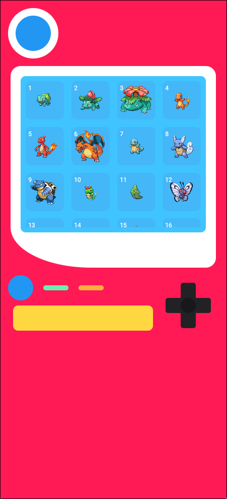
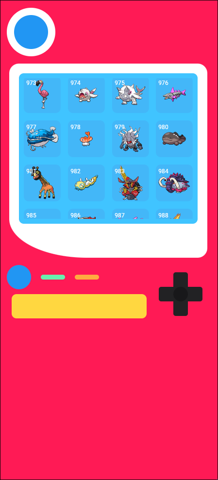

# Pokedex Clean App 🦎

A Flutter application that implements a Pokedex using **Clean Architecture** principles. This project demonstrates a separation of concerns between Domain, Infrastructure, and Presentation layers, ensuring scalability and maintainability.

## 📱 Features

- **Clean Architecture:** Separation of Domain, Infrastructure, and Presentation layers.
- **PokeAPI Integration:** Fetches Pokemon data (names, IDs, sprites) from the official PokeAPI.
- **Custom UI:** A retro Pokedex-inspired design with custom widgets for the D-pad, buttons, and screen bezel.
- **Desktop Support:** Configured with `window_manager` for a seamless desktop experience (custom window size, title, etc.).
- **Efficient State Management:** Uses `Provider` to manage the app state and data fetching.
- **Optimized List Rendering:** Displays a grid of Pokemons using `GridView.builder`.

## 📸 Screenshots

<div style="display: flex; justify-content: center; gap: 20px;">
  
  
</div>

## 🛠 Tech Stack

- **Flutter & Dart**: Core framework and language.
- **Dio**: For HTTP requests and API communication.
- **Provider**: For state management and dependency injection.
- **Window Manager**: For desktop window customization.
- **GetIt**: (Implicit support) The structure supports easy adoption of DI containers.

## 🏗 Architecture Overview

The project follows a strict clean architecture pattern:

### 1. Domain Layer (`lib/domain`)

Contains the business logic and is independent of external libraries.

- **Entities**: Core data models (e.g., `Poke`).
- **Repositories (Interfaces)**: Defines contracts for data operations.
- **Datasources (Interfaces)**: Defines contracts for external data sources.

### 2. Infrastructure Layer (`lib/infrastructure`)

Implements the interfaces defined in the domain layer.

- **Models**: Data Transfer Objects (DTOs) for parsing API responses (e.g., `PokeModel`, `Result`).
- **Datasources**: Implementation of data fetching logic (e.g., `ApiPokeDatasourceImpl` using Dio).
- **Repositories**: Coordinating data from datasources to entities.

### 3. Presentation Layer (`lib/presentation`)

Handles the UI and user interaction.

- **Screens**: Main views (e.g., `MainScreen`).
- **Widgets**: Reusable UI components (`PokeView`, `PokeBubble`, `PokeButton`).
- **Providers**: State management logic (`PokeViewProvider`).

## 🏗️ Project Structure

```text
lib
├── domain
│   ├── datasources
│   │   └── poke_datasource.dart
│   ├── entities
│   │   └── poke.dart
│   └── repositories
│       └── poke_repository.dart
├── infrastructure
│   ├── datasources
│   │   └── api_poke_datasource_impl.dart
│   ├── models
│   │   └── poke_model.dart
│   └── repositories
│       └── poke_repository_impl.dart
├── main.dart
└── presentation
    ├── providers
    │   └── poke_view_provider.dart
    ├── screens
    │   └── main_screen.dart
    └── widgets
        ├── poke_bubble.dart
        ├── poke_button.dart
        └── poke_view.dart
```

## 🚀 Getting Started

1.  **Clone the repository:**
    ```bash
    git clone https://github.com/yourusername/pokedex_clean_app.git
    ```
2.  **Install dependencies:**
    ```bash
    flutter pub get
    ```
3.  **Run the app:**
    ```bash
    flutter run
    ```
